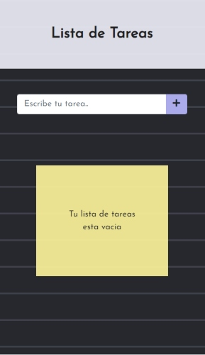
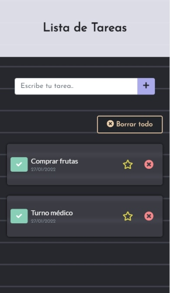
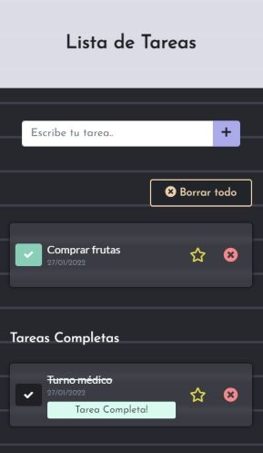
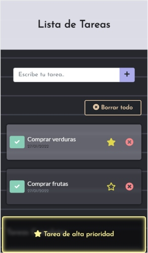
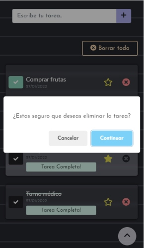
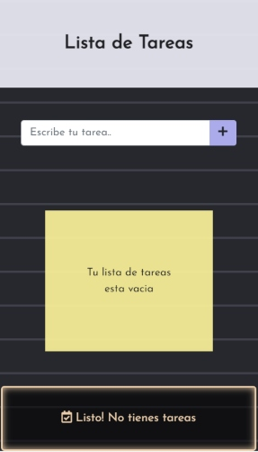

# To Do List
Proyecto Lista de tareas, desarrollado con Javascript.

## Demo
### [To Do List](https://victorianastasi.github.io/todolist/)
 

### Mobile

## Desarrollo
- Para su desarrollo se ha utilizado HTML5, CSS3, Bootstrap (v 5.15.1), JavaScript, localStorage.
- Web responsive, mediante el uso de mediaqueries, desarrollada con la estrategia mobile first.
- Se ha utilizado Git para el control de versiones.
- Se han utilizado tipografías de Google Fonts.

## Autora
GitHub: [victorianastasi](https://github.com/victorianastasi)

LinkedIn: [Victoria Nastasi](https://www.linkedin.com/in/victoria-nastasi-74b007237/)